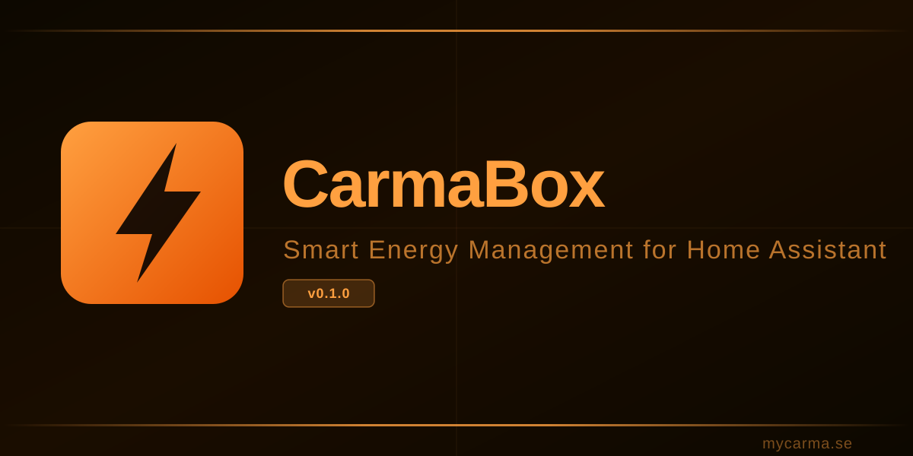
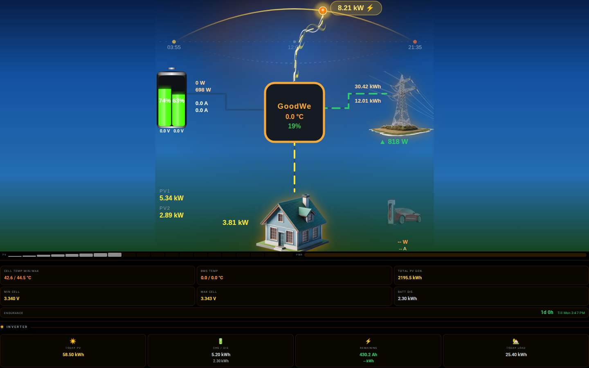

# CarmaBox — Smart Energy Management for Home Assistant

[](https://github.com/hacs/integration)
[](LICENSE)
[](https://www.home-assistant.io)
[](https://github.com/11z4t/carmabox/releases)

**CARMA** = *Connected Automated Resource Management Advisor*

Smart battery charging, surplus optimization, and energy automation for Home Assistant — built for GoodWe + single-battery systems.

---

## v0.1 — What it does

| State | Action |
|-------|--------|
| Grid exporting (>100 W surplus) | Charge battery up to rated max |
| Grid importing (>100 W) | Stop charge — battery standby |
| Battery SoC ≥ ceiling | Stop charge |
| Overnight (00:00–07:00) | Linear discharge to UPS floor |

Self-consumption optimization for single-battery GoodWe systems. No cloud. No complexity.

---

## Dashboard



Real-time energy flow: PV → battery → house → grid. Live SoC, power flows, endurance estimate.

---

## Requirements

- Home Assistant 2025.1+
- GoodWe inverter (single battery bank)
- Grid meter sensor (P1 / HomeWizard / GoodWe built-in)
- GoodWe HA integration

---

## Installation

### Via HACS

1. Open HACS → Integrations → ⋮ → Custom repositories
2. Add: `https://github.com/11z4t/carmabox` → Category: **Integration**
3. Install **CarmaBox** → Restart HA

### Customer Packages

Add the automation package to your HA config:

```yaml
# configuration.yaml
homeassistant:
  packages: !include_dir_named packages/
```

Copy `customer_packages/carmabox_v01.yaml` → `/config/packages/carmabox.yaml`

See `customer_packages/customer_config_example.yaml` for entity mapping.

---

## Components

| Component | Description |
|-----------|-------------|
| `bat_balancer` | Battery charge/discharge coordinator |
| `brain` | PV surplus + overnight discharge logic |
| `ev_balancer` | EV charging optimizer |
| `carmabox` | Core platform + helpers |

---

## Version History

- **v0.1.0** (2026-05-25) — First production release: bat_balancer + mini-brain + telemetry
- **legacy-v5.0.0-prev** — Previous development branch (archived)

---

## License

Apache 2.0 — see [LICENSE](LICENSE)
